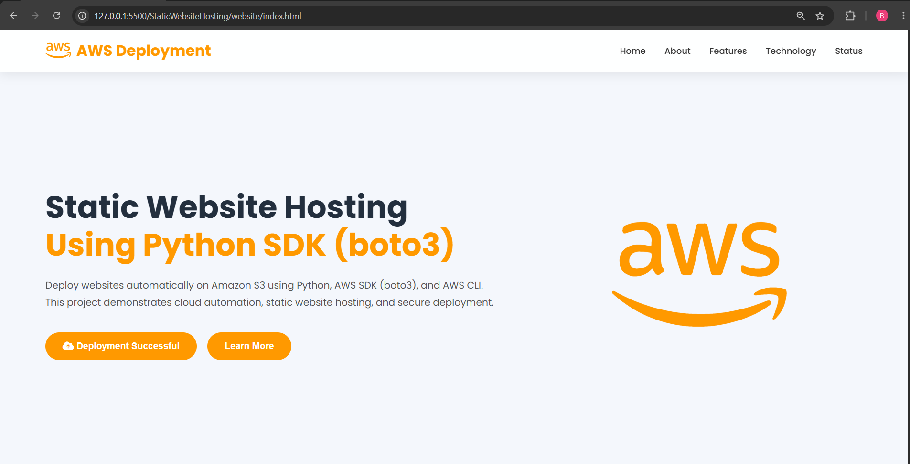
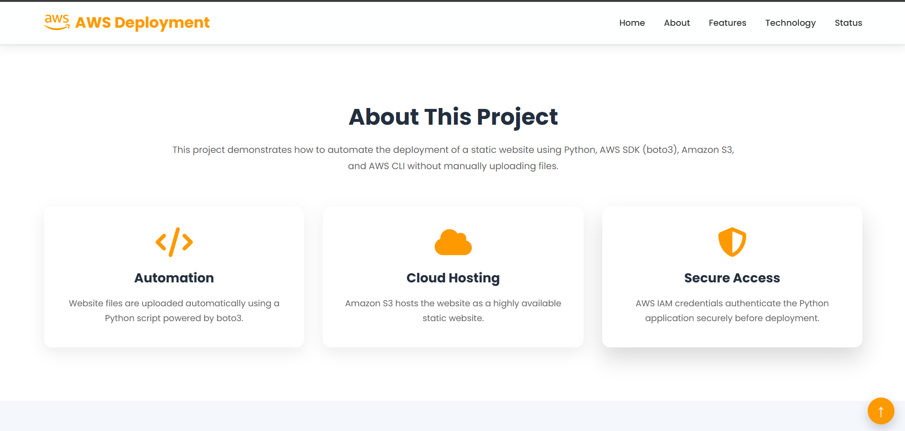
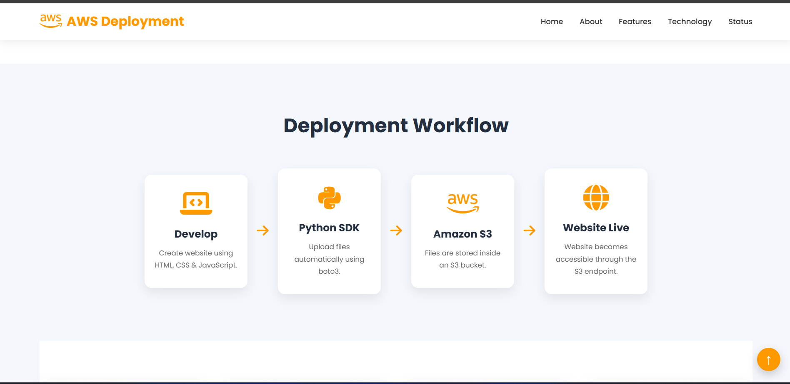
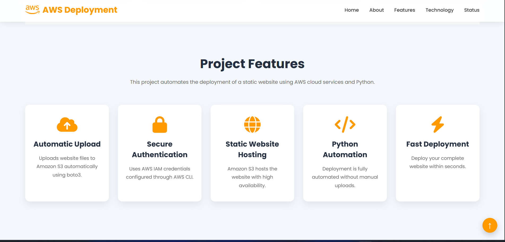
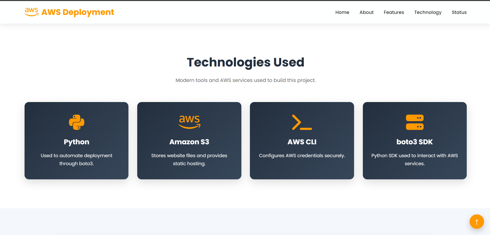
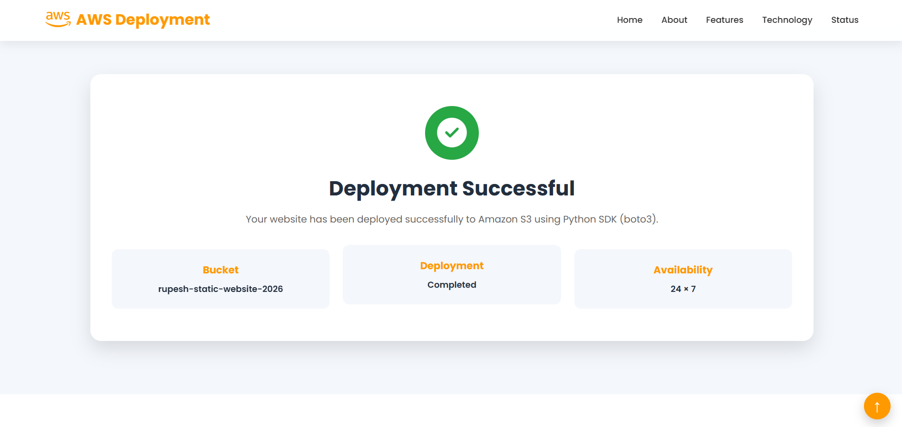
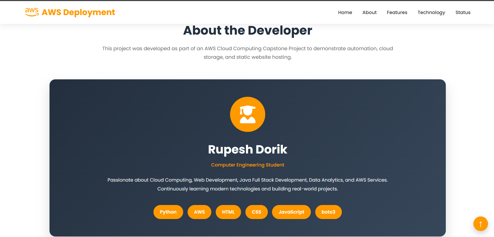
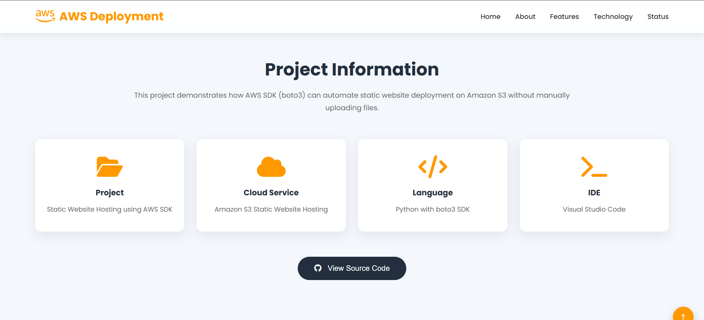

# 🚀 Static Website Hosting Using Python SDK (boto3)


---

## 📌 Project Overview

This project demonstrates how to automate the deployment of a static website to **Amazon S3** using **Python**, **AWS SDK (boto3)**, and the **AWS CLI**.

Instead of manually uploading website files through the AWS Console, the Python script uploads the complete website automatically, making deployment faster, repeatable, and efficient.

---

# 🖥️ Website Preview

## Homepage


---

## 📖 About the Project

This project showcases cloud automation by deploying static website files directly to an Amazon S3 bucket using the Python SDK (boto3).

### Key Highlights

- ✅ Automated Website Deployment
- ✅ Amazon S3 Static Website Hosting
- ✅ AWS CLI Configuration
- ✅ Secure AWS Authentication
- ✅ Python SDK (boto3) Integration
- ✅ Fast and Reliable Deployment

---

## ⚙️ Technologies Used

| Technology | Purpose |
|------------|---------|
| Python | Automation Script |
| boto3 | AWS SDK |
| Amazon S3 | Static Website Hosting |
| AWS CLI | Authentication |
| HTML | Website Structure |
| CSS | Styling |
| JavaScript | User Interaction |
| Visual Studio Code | Development |

---

# 🏗️ Project Architecture

```
Developer
     │
     ▼
Python Script (boto3)
     │
     ▼
Amazon S3 Bucket
     │
     ▼
Static Website Hosting
     │
     ▼
Website Live
```

---

## 📂 Project Structure

```
StaticWebsiteHosting/
│
├── website/
│   ├── index.html
│   ├── style.css
│   ├── script.js
│
├── upload.py
├── screenshots/
├── README.md
└── requirements.txt
```

---

## 🖥️ Website Preview



---

## 📸 Project Screenshots

### Homepage


### About Section


### Deployment Workflow


### Project Features


### Technologies Used


### Deployment Success


### Developer Section


### Project Information


---

# 🚀 How to Run

### Clone Repository

```bash
git clone https://github.com/rupeshdorik/StaticWebsiteHosting.git
```

### Install Dependencies

```bash
pip install boto3
```

### Configure AWS CLI

```bash
aws configure
```

### Run Deployment Script

```bash
python upload.py
```

---

# 📊 Features

- Automated Website Upload
- Static Website Hosting on Amazon S3
- Secure AWS Authentication
- Python SDK Integration
- Cloud Automation
- Responsive Website Design
- Fast Deployment Process

---

# 🎯 Future Enhancements

- GitHub Actions CI/CD
- CloudFront Integration
- Custom Domain Support
- HTTPS using ACM
- Automatic Cache Invalidation
- Deployment Logs

---

# 👨‍💻 Author

**Rupesh Dorik**

Computer Engineering Student

Passionate about Cloud Computing, AWS, Web Development, Java Full Stack Development, and Data Analytics.

---

## ⭐ If you found this project useful, don't forget to star the repository!
